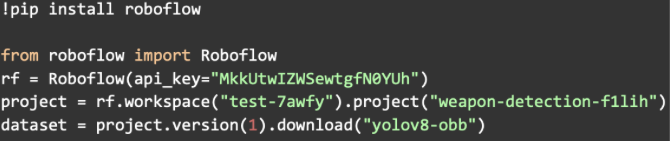

# Guard Eye : Video Vigilance for Weapon Detection

<b> Abstract </b>

The escalating threats posed by firearms necessitate advanced weapon detection systems for enhanced security. Our research introduces a novel weapon detection system based on YOLOv8, capable of real-time threat identification. By leveraging deep learning, our system provides high accuracy with minimal false positives, augmenting surveillance measures in diverse environments. It can be deployed in airports, schools, stadiums, and urban centers, offering proactive security measures to protect lives and prevent potential security breaches. This research contributes to the development of intelligent security solutions, fostering safer communities and addressing the urgent need for robust threat detection systems.

<b> System Overview </b>

The Real-time Weapon Detection System that we are introducing aims to improve security by detecting and recognizing various weapons such as grenades, missiles, pistols, rifles, and knives in a live video broadcast stream, with input in the form of an Internet Protocol (IP) address that hosts the video stream array. The system uses a You Only Look Once (YOLO) strategy for object detection, fine-tuning the YOLOv8 model with the weapons dataset. When a possible weapon with a frame of the object and a security alert is found, the technology immediately alerts the authorized personnel to the security dangers.
The components of the system include :

1. User Interface Module: The Internet Protocol (IP) based camera detection interface, is a key component in our research. This interface blends in perfectly with our system, providing an efficient way to connect to  the input camera. The Internet Protocol address of the camera is provided in the input field which on click of a stat button connects to the input camera and leads to the detection script. This method allows us to apply our concept to the camera apparatus that is currently on the risk-prone sites.

2. YOLOv8 Model : We are using the YOLOv8 model that is imported in the form of a python package that comes as a part of the Ultralytics python module. We have used the cli to train and fine-tune the yolov8 model by providing the weapons dataset and using the best weights file to finally perform the prediction on the input coming in the form of a video from a live feed Video source. The modes that we have explored with the model are "train" for fine-tuning the model by training on the weapons dataset and "predict" to identify the objects.

3. Detection Module : The real-time weapon detection module is meant to accept input in the form of a live video stream from a camera whose Internet Protocol address was provided by the user interface using the openCV script and Python's torch module. In order to start the current model state, it eventually uses the Ultralytics module to import the Yolov8 model and loads the last-best fine-tuned weights file, or "Best.pt." then uses yolo-based detection in the "predict" mode to ascertain in real time whether the supplied frame has a weapon or not.

4. Alerting Module : The alerting module uses the Python Simple Mail Transfer Protocol (SMTP) module for email delivery and authentication in order to interface with the implemented detecting modules. The module receives two addresses: a base address used for application authentication and a to_address used to receive alert-related mail. The alerting system quickly generates an email including the object and its accompanying bounding box, or Object Bounding Box (OBB) frame, upon detecting a true positive item with threshold confidence percentage, sends it to the recipient's email address. 

<b> Result Analysis </b>

The dataset used is taken from robflow.org which is already annotated and is publicly available for access and is fetched by the means of the roboflow inference hosted API as shown in figure is taken from roboflow.

The dataset follows the You Only Look Once - Object Bounding Box (YOLO-OBB) format and is having the class management as described in the table

The dataset has 0 missing annotations and 24 Null examples, there are total of 14,981 annotations with an average of 1.6 per image divided across 5 classes [0: Pistol, 1: Rifle, 2: Grenade, 3: Missile, 4: Knife]. The average image size is 0.41 Million Pixels (mp). The following dataset was implemented to fine tune the YOLOv8 model and we have got the final result as described using the figure as confusion matrix at 800 epochs and figure through graphs plotted against box loss (box_loss), class loss (cls_closs), and focal loss (dfl_loss) at training and validation. Also the performance metrics as precision, recall and mean average precision (mAP) at training and validation were shown.

On testing with the live video feed the detections at 75% confidence were shown in figure.

